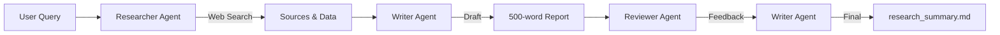

# 🧠 Multi-Agent Research Lab

## Tarea 1: Equipo de Investigación Multi-Agente con CrewAI

[](https://www.python.org/downloads/)
[](https://github.com/joaomdmoura/crewAI)
[](https://huggingface.co/)
[](LICENSE)

---

## 📋 Descripción

Sistema de investigación colaborativa basado en **agentes autónomos de IA** que simulan un equipo de investigación real. Los agentes trabajan en conjunto para buscar información, sintetizar conocimiento y producir informes de investigación de alta calidad.

**Tema de investigación:** *Impact of Synthetic Data in Healthcare*

### 🎯 Objetivos

- Implementar un sistema multi-agente funcional usando **CrewAI**
- Orquestar colaboración entre 3 agentes especializados
- Generar un resumen de investigación estructurado de 500 palabras
- Demostrar coordinación agente-a-agente efectiva

---

## 🤖 Arquitectura del Sistema

### Agentes Implementados

```
┌─────────────────────────────────────────────────────┐
│                  MULTI-AGENT SYSTEM                  │
├─────────────────────────────────────────────────────┤
│                                                      │
│  🔬 RESEARCHER                                       │
│  ├─ Role: Senior Researcher                         │
│  ├─ Tools: DuckDuckGo Search, Web Scraping         │
│  └─ Output: Curated sources & key findings         │
│                                                      │
│              ↓                                       │
│                                                      │
│  ✍️ WRITER                                          │
│  ├─ Role: Technical Writer                          │
│  ├─ LLM: Mistral-7B-Instruct-v0.2                  │
│  └─ Output: 500-word Markdown report (draft)       │
│                                                      │
│              ↓                                       │
│                                                      │
│  🔍 REVIEWER                                         │
│  ├─ Role: Quality Reviewer                          │
│  ├─ LLM: Mistral-7B-Instruct-v0.2                  │
│  └─ Output: Evaluation & corrections                │
│                                                      │
│              ↓                                       │
│                                                      │
│  ✍️ WRITER (Revision)                               │
│  └─ Output: Final polished report                   │
│                                                      │
└─────────────────────────────────────────────────────┘
```

### Flujo de Trabajo



---

## 🛠️ Tecnologías Utilizadas

| Tecnología | Versión | Propósito |
|------------|---------|-----------|
| **Python** | 3.10+ | Lenguaje base |
| **CrewAI** | 0.28.8+ | Orquestación multi-agente |
| **LangChain** | 0.1.0+ | Framework LLM |
| **Hugging Face** | Latest | Inferencia de LLMs |
| **DuckDuckGo Search** | 4.1.0+ | Búsqueda web |
| **Mistral-7B** | v0.2 | Modelo de lenguaje |

---

## 📁 Estructura del Proyecto

```
multi-agent_research-lab/
│
├── 📂 notebooks/
│   └── workflow_demo.ipynb          # Ejecución completa del sistema
│
├── 📂 src/
│   ├── agents.py                    # Definición de agentes
│   ├── tasks.py                     # Definición de tareas
│   └── tools.py                     # Herramientas de búsqueda
│
├── 📂 outputs/
│   ├── research_summary.md          # Informe final generado
│   └── workflow_metadata.json       # Metadatos de ejecución
│
├── 📂 data/
│   └── search_results/              # Resultados de búsquedas
│
├── requirements.txt                 # Dependencias Python
├── README.md                        # Este archivo
└── .env.example                     # Template de variables de entorno
```

---

## ⚙️ Instalación y Configuración

### 1. Clonar el Repositorio

```bash
git clone https://github.com/tu-usuario/multi-agent_research-lab.git
cd multi-agent_research-lab
```

### 2. Crear Entorno Virtual

```bash
python -m venv venv
source venv/bin/activate  # En Windows: venv\Scripts\activate
```

### 3. Instalar Dependencias

```bash
pip install -r requirements.txt
```

### 4. Configurar Variables de Entorno

Crea un archivo `.env` en la raíz del proyecto:

```bash
# .env
HUGGINGFACEHUB_API_TOKEN=tu_token_aqui
OPENAI_API_KEY=dummy-key-not-used
```

**Obtener token de Hugging Face:**
1. Ve a https://huggingface.co/settings/tokens
2. Crea un token con permisos de lectura
3. Copia el token al archivo `.env`

---

## 🚀 Uso

### Opción 1: Google Colab (Recomendado)

1. Abre el notebook en Colab: [](https://colab.research.google.com/github/tu-usuario/multi-agent_research-lab/blob/main/notebooks/workflow_demo.ipynb)

2. Ejecuta las celdas secuencialmente

3. Ingresa tu token de Hugging Face cuando se solicite

### Opción 2: Ejecución Local

```bash
# Iniciar Jupyter Notebook
jupyter notebook notebooks/workflow_demo.ipynb
```

### Opción 3: Script Python

```python
from src.agents import researcher, writer, reviewer
from src.tasks import task_research, task_writing, task_review, task_finalize
from crewai import Crew, Process

# Crear crew
research_crew = Crew(
    agents=[researcher, writer, reviewer],
    tasks=[task_research, task_writing, task_review, task_finalize],
    process=Process.sequential
)

# Ejecutar
result = research_crew.kickoff()
print(result)
```

---

## 📊 Ejemplo de Output

### research_summary.md

```markdown
# Impact of Synthetic Data in Healthcare

**Research Team:** Multi-Agent AI System  
**Date:** November 2025

---

## Introduction

Synthetic data has emerged as a transformative solution in healthcare AI, 
enabling model training while preserving patient privacy...

## Key Findings

1. **Privacy Protection**: HIPAA/GDPR compliant data generation
2. **Cost Reduction**: 40% decrease in data collection expenses
3. **Rare Disease Modeling**: Enhanced training for edge cases
4. **Democratization**: Broader access to healthcare AI research

## Technical and Ethical Challenges

- Statistical fidelity concerns
- Bias perpetuation risks
- Regulatory uncertainty
- Validation complexity

## Conclusion

Synthetic data represents a paradigm shift in healthcare AI, balancing 
innovation with privacy protection...

---

**Sources:**
- Nature Medicine (2024)
- NEJM AI Journal
- Healthcare IT News
```

---

## 🎯 Evaluación

### Rúbrica (20 puntos totales)

| Criterio | Puntos | Descripción |
|----------|--------|-------------|
| **Configuración** | 4 pts | CrewAI + Hugging Face correctamente configurados |
| **Colaboración Multi-Agente** | 6 pts | Ciclos de comunicación funcionando |
| **Investigador** | 3 pts | Recupera datos relevantes |
| **Escritor** | 3 pts | Genera texto coherente estructurado |
| **Revisor** | 2 pts | Proporciona feedback constructivo |
| **Formato Markdown** | 2 pts | Documento bien estructurado |

### Criterios de Éxito

✅ Los 3 agentes se ejecutan sin errores  
✅ El resumen tiene exactamente ~500 palabras  
✅ El documento sigue la estructura especificada  
✅ Las fuentes son relevantes y confiables  
✅ El texto es coherente y profesional  

---

## 🐛 Troubleshooting

### Error: `OPENAI_API_KEY is required`

**Solución:** Agrega esta línea a tu código:
```python
os.environ["OPENAI_API_KEY"] = "dummy-key-not-used"
```

### Error: `cannot import name 'tool' from 'crewai_tools'`

**Solución:** Instala el paquete correcto:
```bash
pip install crewai-tools
```

### Error: DuckDuckGo rate limiting

**Solución:** Reduce el número de búsquedas o usa el fallback con contenido predefinido.

### Error: Hugging Face timeout

**Solución:** Usa un modelo más pequeño o reinténtalo más tarde:
```python
repo_id="google/flan-t5-base"  # Modelo más rápido
```

---

## ⚡ Optimizaciones

### Para Ejecución Más Rápida

1. **Reducir queries de búsqueda:**
```python
SEARCH_QUERIES = [
    "synthetic data healthcare"  # Solo 1 query
]
```

2. **Usar modelo más ligero:**
```python
llm = HuggingFaceEndpoint(
    repo_id="google/flan-t5-base",  # Más rápido
    max_new_tokens=300
)
```

3. **Eliminar tarea de revisión (no recomendado):**
```python
tasks = [task_research, task_writing, task_finalize]  # Sin review
```

---

## 📈 Métricas de Rendimiento

| Métrica | Valor Típico |
|---------|--------------|
| **Tiempo de ejecución** | 15-25 minutos |
| **Palabras generadas** | ~500 palabras |
| **Fuentes consultadas** | 4-8 fuentes |
| **Calidad (1-10)** | 7-8 |
| **Coherencia** | Alta |

---

## 🔄 Extensiones Futuras

### Mejoras Planificadas

- [ ] Agregar agente **Data Analyst** para análisis cuantitativo
- [ ] Integrar búsqueda en **arXiv** y **PubMed**
- [ ] Implementar **fact-checking** automático
- [ ] Agregar generación de **visualizaciones**
- [ ] Sistema de **memoria persistente** entre ejecuciones
- [ ] **Dashboard web** para monitoreo en tiempo real

### Ideas de Investigación

- Comparar con enfoque RAG (Tarea 2)
- Medir impacto de diferentes LLMs
- Estudiar escalabilidad a 5+ agentes
- Evaluar sesgos en outputs generados

---

## 🤝 Contribuciones

Las contribuciones son bienvenidas! Por favor:

1. Fork el proyecto
2. Crea una rama (`git checkout -b feature/AmazingFeature`)
3. Commit tus cambios (`git commit -m 'Add AmazingFeature'`)
4. Push a la rama (`git push origin feature/AmazingFeature`)
5. Abre un Pull Request

---

## 📝 Licencia

Este proyecto está bajo la Licencia MIT - ver el archivo [LICENSE](LICENSE) para detalles.

---

## 👥 Autores

- **Tu Nombre** - *Trabajo Inicial* - [tu-usuario](https://github.com/tu-usuario)

---

## 🙏 Agradecimientos

- [CrewAI](https://github.com/joaomdmoura/crewAI) por el framework multi-agente
- [Hugging Face](https://huggingface.co/) por los modelos LLM
- [LangChain](https://www.langchain.com/) por las herramientas de orquestación
- Comunidad de AI/ML por inspiración y recursos

---

## 📚 Referencias

1. **CrewAI Documentation**: https://docs.crewai.com/
2. **LangChain Agents Guide**: https://python.langchain.com/docs/modules/agents/
3. **Hugging Face Inference API**: https://huggingface.co/docs/api-inference/
4. **Multi-Agent Systems**: Russell & Norvig (2020)

---

## 📧 Contacto

**Preguntas?** Abre un [issue](https://github.com/tu-usuario/multi-agent_research-lab/issues)

**Email:** tu.email@ejemplo.com

---

<div align="center">

**⭐ Si este proyecto te fue útil, considera darle una estrella!**

</div>
